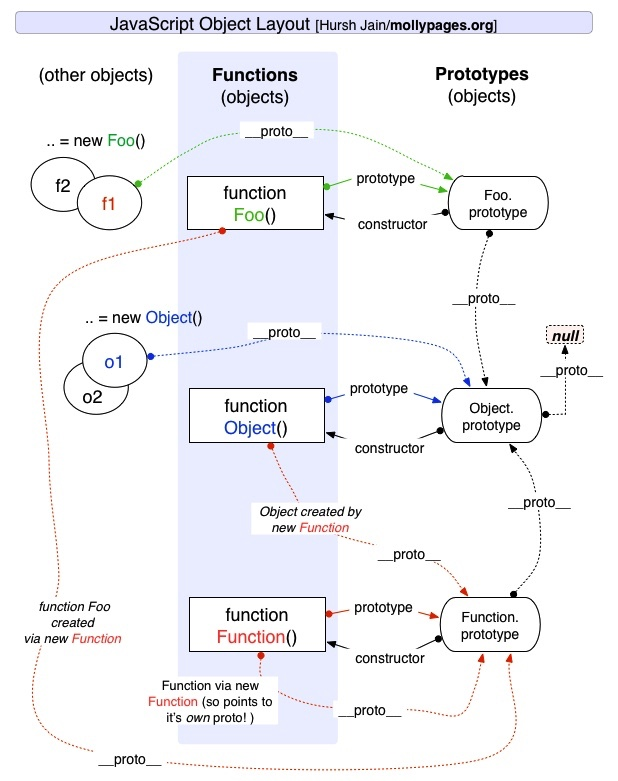

<!--
Created: Mon Feb 03 2020 19:52:29 GMT+0800 (China Standard Time)
Modified: Mon Jun 15 2020 19:54:19 GMT+0800 (China Standard Time)
-->
<!-- Tag: js -->

# js 原型链

原型链与继承息息相关. 我们 new 一个对象出来的时候，会继承构造函数的属性和方法的，可是构造函数内部的是属于自己的属性和方法，所以为了能够实现这种继承，函数用 prototype 属性来储存可以被继承的属性和方法。 而实例则通过 `__proto__` 来找到父类的方法， 同时，为了知道这个实例是由哪个构造函数创建的，我们用 constructor 来指向创建它的构造函数, 由于 prototype 也是对象，所以它也是有 constructor 的。

## `__proto__` 

在JS里，万物皆对象。方法（Function）是对象，方法的原型(Function.prototype)是对象。因此，它们都会具有对象共有的特点。即：对象具有属性`__proto__`，可称为隐式原型，指向构造该对象的构造函数的原型，它让实例能够访问在构造函数原型中定义的属性和方法。

> MDN 建议只使用 `Object.getPrototypeOf()/Object.setPrototypeOf`，详见[链接🔗](https://developer.mozilla.org/zh-CN/docs/Web/JavaScript/Reference/Global_Objects/Object/proto)
## prototype

函数是特殊的对象，只有 **函数** 才有 prototype 属性。
prototype 是一个有 constructor 属性的对象。
prototype 属性的作用就是让该函数所实例化的对象们都可以找到公用的属性和方法，即 `f1.__proto__ === Foo.prototype` 。

## constructor 构造器

constructor 是每个 **实例对象** 都会拥有的属性，而且这个属性的实在意义在于一个指针，它指向了创建当前这个实例对象的类。
constructor 的属性值是可以随时改变的，如果不赋值，那就默认指向了创建这个实例对象的类，如果赋值了，那就会指向所赋值。

``` js
function Person() {}
let p = new Person();
console.log(p.constructor);
// ƒ Person() {}
//p.constructor 指向的是 Person 对象
```

创建函数时，JS会为这个函数自动添加 prototype 属性，值是一个有 constructor 属性的对象，不是空对象。js 的函数既可以作为普通函数被调用，也可以作为构造器被调用。一旦把这个函数当作构造函数（constructor）调用（即通过new关键字调用），那么JS就会创建该构造函数的实例，实例继承构造函数prototype的所有属性和方法（实例通过设置自己的 `__proto__` 指向承构造函数的 prototype 来实现这种继承）。

## 原型链

### 构造函数

在js中, 实际上并不存在所谓的'构造函数'，只有对于函数的'构造调用'。

我们需要牢记两点：

1. `__proto__` 和constructor属性是对象所独有的； prototype 属性是函数所独有的，因为函数也是一种对象，所以函数也拥有 `__proto__` 和 constructor 属性。

2. `__proto__` 属性的作用就是当访问一个对象的属性时，如果该对象内部不存在这个属性，那么就会去它的 `__proto__` 属性所指向的那个对象（父对象）里找，一直找，直到 `__proto__` 属性的终点null，然后返回undefined，再往上查找就相当于在null上获取属性，则报错。通过 `__proto__` 属性将对象连接起来的这条链路即我们所谓的原型链。

4. constructor  属性的含义就是指向该对象的构造函数，所有函数（此时看成对象了）最终的构造函数都指向 Function。

**Object.prototype是原型链的顶端。**


