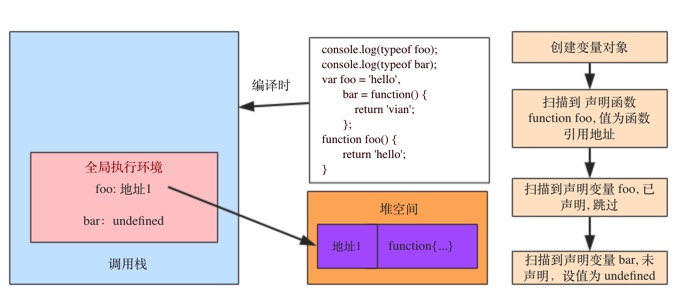
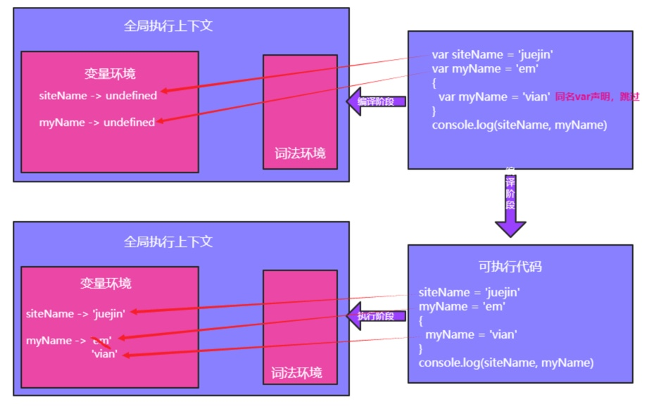
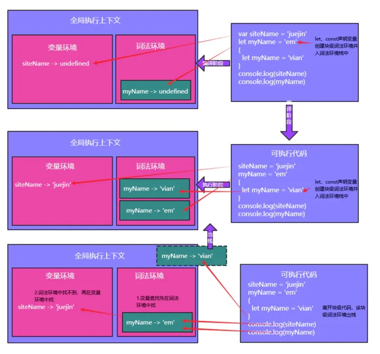
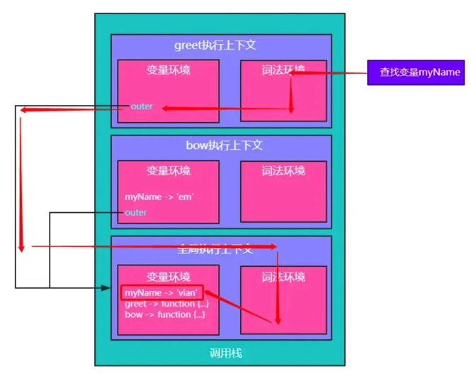

<!--
Created: Wen Feb 05 2020 23:21:53 GMT+0800 (China Standard Time)
Modified: Sun Jun 14 2020 23:43:55 GMT+0800 (China Standard Time)
-->

<!-- js -->

# js 执行过程

> 起因是看到一道关于 js 中变量提升的面试题，在做题是做错了，并且不知道为什么，发现自己对于 js 执行环境、作用域 并不是十分的清楚，以及 js 的执行过程也并不是很清楚，所以不知道为什么 var 会使得变量提升。虽然之前慕逸哥哥给自己讲过一遍，也看了关于执行过程的文章，但果然不系统的看一遍和整理一遍是不理解的。所以整理一下，以后也好再次温习。

**keywords**： 执行环境、执行栈、变量环境、词法环境、作用域、代码空间、堆空间、栈空间

看完可理解：闭包，变量提升

[闭包](https://www.cnblogs.com/wangfupeng1988/p/3994065.html)

[Js 执行过程详解\[掘金\]](https://juejin.im/post/5cc952f351882541e94d8994)

[从执行机制层面理解闭包](https://juejin.im/post/5ddbd544e51d45234b6de26b) tips: 最后关于闭包的解释有误

[理解js中的执行上下文和栈](https://juejin.im/post/5ba32171f265da0ab719a6d7)

## 概念

### 执行环境/执行上下文

JavaScript 是运行时编译的语言，js 引擎会在执行 **代码段** 前进行编译，生成 执行上下文 和 可执行代码。

执行环境（execution content），也叫执行上下文，定义了变量或函数有权访问的其他数据。每个执行环境都有一个与之对应的 变量对象，环境中定义的所有变量和函数都保存在这个对象中，我们编写的代码无法访问这个对象，但 js 解析器在处理数据时会在后台使用它。

执行环境分三类：

* 全局执行环境
  + 这是默认或者说基础的执行环境，任何不在函数内部的代码都在全局执行环境中。它会执行两件事：创建一个全局的对象（浏览器的情况下为window），并且设置 this 的值等于这个全局对象。一个程序中只会有一个全局执行环境，全局执行环境只有在应用退出（关闭网页等行为）才会被销毁
* 函数执行环境
  + 每当一个函数被调用时, 都会为该函数创建一个新的执行环境。每个函数都有它自己的执行环境，不过是在函数被调用时创建的。函数执行环境可以有任意多个。
* eval 函数执行上下文 (较少使用，略)

### 执行栈

执行环境栈（Execution Context Stack），或调用栈，是一种 LOFI(先进后出) 的数据结构的栈，用来存储代码运行时所创建的所有执行上下文。

JavaScript 在编译阶段，会创建一个全局的执行上下文并且压入当前执行栈。编译时每当遇到一个函数，它会为该函数创建一个新的执行上下文并压入栈的顶部。

引擎会执行那些执行上下文位于栈顶的函数。当该函数执行结束时，执行上下文从栈中弹出，控制流程到达当前栈中的下一个上下文。

关于执行环境栈，有以下几点要特别注意：

* 单线程
* 同步执行
* 只有一个全局执行环境
* 可以有无数个的非全局执行环境
*  每一次函数调用都会创建一个新的执行环境，即使是调用自身

### 词法环境

编译阶段，JavaScript引擎会创建一个执行上下文，执行上下文包含变量环境。

简单来说，词法环境就是相应代码块内标识符与值的关联关系的体现。（ES6之后作用域概念变为词法环境概念）。

在 ES6 中，词法环境 和 变量环境 的一个不同就是前者被用来存储函数声明和变量（let 和 const）绑定，而后者只用来存储 var 变量绑定。

> 词法环境中每一个块级数据中不允许出现相同的变量，否则会报错：Identifier 'xxx' has already been declared

> let、const声明的声明虽然也会在编译阶段被处理，但是它们却不能达到变量提升的效果。如下代码会报错Cannot access 'myName' before initialization。这是因为暂时性死区的存在：语法规定let声明前不可达。

词法环境有两个组成部分：

1. 环境记录（Environment Record）：记录相应代码块的标识符绑定。

    可以理解为相应代码块内的所有变量声明、函数声明（代码块若为函数还包括其形参）都储存于此，对应ES6之前的变量对象or活动对象

2. 对外部词法环境的引用（outer）：用于形成多个词法环境在逻辑上的嵌套结构，以实现可以访问外部词法环境变量的能力。

    词法环境在逻辑上的嵌套结构对应ES6之前的作用域链

### 变量对象、活动对象

变量对象VO和活动对象AO是同一个对象在不同阶段的表现形式。当进入执行环境的创捷阶段时，变量对象被创建，这时变量对象的属性无法被访问。进入执行阶段后，变量对象被激活变成活动对象，此时活动对象的属性可以被访问。

### 作用域 与 作用域链

作用域： 即可访问变量的合集。作用域是在运行时代码中的某些特定部分中变量，函数和对象的可访问性。换句话说，作用域决定了代码区块中变量和其他资源的可见性
 - 全局作用域
 - 函数作用域
 - 块级作用域（ES6新增）

作用域链： 当代码在一个环境中执行时，会创建变量对象的一个作用域链(scope chain)。作用域链的用途，是 **保证对执行环境有权访问的所有变量和函数的有序访问**。作用域链的前端，始终都是当前执行的代码所在环境的变量对象。如果这个环境是函数，则将其活动对象(activation object)作为变量对象。活动对象在最开始时只包含一个变量，即 arguments 对象(这个对象在全局环境中是不存在的)。作用域链中的下一个变量对象来自包含(外部)环境，而再下一个变量对象则来自下一个包含环境。这样，一直延续到全局执行环境; 全局执行环境的变量对象始终都是作用域链中的最后一个对象。

简单来说，每个执行上下文在创建的时候，其变量环境都会有一个根据词法作用域判定的引用（outer），指向另外一个执行上下文（全局执行上下文outer为null）

### 代码空间、堆空间、栈空间

**代码空间**： 存放 js 在编译时产生的可执行的代码。

**堆空间**： 存放 引用类型数据类型的数据，即对象及其子类。

**栈空间**： 存放执行上下文，栈空间只存放基本数据类型的数据，若执行上下文中某变量为引用类型Object对象，在变量环境（或词法环境）中该变量的值只是该对象的一个引用地址。 

## 执行过程 

搞明白这几段代码，就基本搞明白了js执行过程

### 例1
``` js
console.log(typeof foo); // function
console.log(typeof bar); // undefined
var foo = 'hello',
    bar = function() {
        return 'vian';
    };
function foo() {
    return 'hello';
}
```



js 是解释型语言，所以当函数在调用时才会将自身的执行环境推入 执行栈, 在运行到赋值语句时才对变量进行赋值。

在这段代码中，只有全局执行环境。
js 优先 解释声明式函数，再解释声明变量。

### 例2

``` js
var siteName = 'juejin'
var myName = 'em' {
    var myName = 'vian'
}
console.log(siteName, myName) // juejin vian
```



### 例3

``` js
var siteName = 'juejin'
let myName = 'em' {
    let myName = 'vian'
}
console.log(siteName, myName) // juejin vian
```



### 例4:

``` js
var myName = 'vian'

function greet() {
    console.log(myName)
}

function bow() {
    var myName = 'em'
    greet()
}
bow() //vian
```



## 闭包

闭包

``` js
function foo() {
    const name = 'ayi'
    var bar = function() {
        console.log(name)
    }
    return bar
}
let greet = foo()
greet() // ayi
```

1. 代码执行前生成全局上下文，执行对变量赋值，此时全局上下文是活跃状态
2. 执行 `foo()` 函数 ，生成 foo 上下文并压入栈，此时 foo 上下文为活跃状态
3. `foo()` 执行完成，返回 bar 函数，js解释器发现该函数存在 foo 函数上下文中 name 变量的引用，所以 foo 上下文不销毁，仍存在栈中，此时全局上下文是活跃状态
4. 执行 `greet()` 函数，即 bar 函数, 生成 bar 上下文，并压入栈，此时栈中存在，bar上下文为活跃状态
5. `greet()` 执行完成，上下文销毁

## 小结

* js 在执行过程中会创建唯一一个全局执行环境和若干个函数执行环境
* 全局执行环境最先创建，并压入执行栈底部，当调用函数时，会创建函数的执行环境并压入执行栈
* 执行环境在创建阶段(函数被调用，代码未执行时)，创建变量对象，建立作用域链，确定this的指向。
* 创建阶段：
   1. js 解析器 根据函数参数，创建并初始化arguments对象，及形参属性
   2. 检查环境中的函数声明，将函数名作为变量对象的属性，函数引用作为值。如果该函数名在变量对象中已存在，则覆盖已存在的函数引用。
   3. 检查环境中的变量声明，将变量名作为变量对象的属性，值设置为undefined。如果该变量名在变量对象中已存在，为防止与函数名冲突，则跳过，不进行任何操作。
* 执行阶段 在这个阶段进行赋值、寻找函数引用、执行代码。
* 代码执行完毕，则该执行环境销毁出栈，程序到栈顶的执行环境继续执行，直到回到全局执行环境中执行，全局环境的代码即使执行完毕，也不会销毁，直至网页或浏览器被关闭了才出栈销毁。
