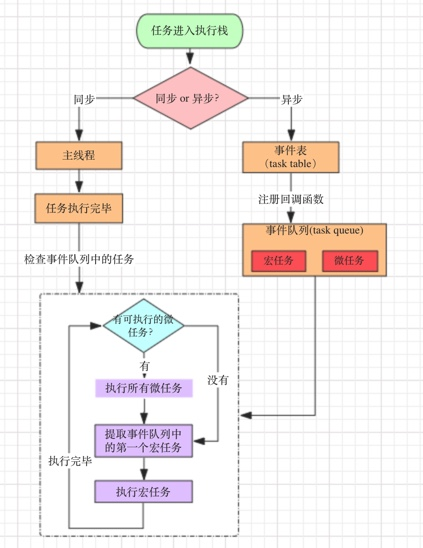

<!--
Created: Fri Feb 07 2020 20:25:49 GMT+0800 (China Standard Time)
Modified: Mon Jun 15 2020 20:27:00 GMT+0800 (China Standard Time)
-->
<!-- Tag: browser, js -->

# JS 事件循环

> 从 js 执行说开去，肯定会遇到事件循环，所以这一次也把事件循环整理一下吧，又是一个曾经看一遍忘记一遍的知识点，不整理归纳一下，下次一定还是会忘记的。

**keywords:** 宏任务(macro-task)、微任务(micro-task)、主线程、事件表(Event Table)、事件队列(Event Queue)

<u>搞明白关键词之间的关系，就大概明白了事件循环</u>

相关链接：
[图解 js 执行机制](https://juejin.im/post/5b879a9f6fb9a01a0f24a5e1)
[js Event Loop 运行机制](https://juejin.im/post/5b67108e5188251aa30c8811)

* 进程： 运行的程序就是一个进程，比如你正在运行的浏览器，它会有一个进程。
* 线程： 程序中独立运行的代码段。一个进程 由单个或多个 线程 组成，线程是负责执行代码的。

主线程运行的时候，产生堆（heap）和执行栈（stack)

## 宏任务

可以理解是每次执行栈执行的代码就是一个宏任务(包括每次从事件队列中获取一个事件回调并放到执行栈中执行)。
浏览器为了能够使得 JS 内部 macro-task与 DOM 任务能够有序执行，会在一个 macro-task 执行结束后，在下一个 macro-task 执行开始前，对页面进行重新渲染。

**macro-task 主要包含**：script(整体代码)、setTimeout、setInterval、I/O、UI 交互事件、postMessage、MessageChannel、setImmediate(Node.js 环境)

## 微任务

可以理解是在当前 task 执行结束后立即执行的任务。也就是说，在当前 task 任务后，下一个 task 之前，在渲染之前。所以它的响应速度相比 setTimeout 会更快，因为无需等渲染。也就是说，在某一个 macrotask 执行完后，就会将在它执行期间产生的所有 microtask 都执行完毕（在渲染前）。

包括： Promise

## process.nextTick

process.nextTick 是 Node.js 提供的一个与"任务队列"有关的方法，它产生的任务是放在 执行栈的尾部，并不属于 宏任务 和 微任务，因此它的任务 总是发生在所有异步任务之前。

#### 执行流程



1. js 分同步任务和异步任务。
2. 同步任务进入主线程执行。
3. 异步任务进入事件表（Event Table），当事件表中的异步任务完成后，会在事件队列（event queue）中注册回调函数。
4. 主线程任务全部执行完成后，会检查事件队列是否为空
5. 事件队列中分宏任务队列和微任务队列。
6. 执行完所有微任务，再执行宏任务队列中的第一个宏任务
7. js解析器会不断地重复检查主线程执行栈是否为空，然后重复第4-7步，这就是Event Loop（事件循环）。

#### 练习

```js
console.log('1');
// 记作 set1
setTimeout(function() {
    console.log('2');
    // set4
    setTimeout(function() {
        console.log('3');
    });
    // pro2
    new Promise(function(resolve) {
        console.log('4');
        resolve();
    }).then(function() {
        console.log('5')
    })
})

// 记作 pro1
new Promise(function(resolve) {
    console.log('6');
    resolve();
}).then(function() {
    console.log('7');
    // set3
    setTimeout(function() {
        console.log('8');
    });
})

// 记作 set2
setTimeout(function() {
    console.log('9');
    // 记作 pro3
    new Promise(function(resolve) {
        console.log('10');
        resolve();
    }).then(function() {
        console.log('11');
    })
})
```
