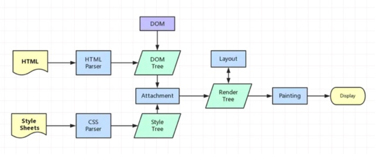

<!--
Created: Sun Feb 09 2020 23:58:54 GMT+0800 (China Standard Time)
Modified: Sun Jun 14 2020 23:58:54 GMT+0800 (China Standard Time)
-->
<!-- Tag: browser -->

# 浏览器渲染过程

> 又是一个曾经看一遍忘一遍的知识点。这两天自己通过学习加整理，发现还是比以前仅仅浏览记的要牢靠的。自己整理一遍的时候才会发现有含糊不清的东西，而不是 错误的以为自己已经掌握了。所以判断自己是否掌握某项知识的标准果然还是在于自己能不能清晰有条理的把它整理出来。为这些年懒惰的自己感到痛心和怒其不争。

相关链接🔗：
[从 8 道面试题看浏览器渲染过程与性能优化](https://juejin.im/post/5e143104e51d45414a4715f7)
[浏览器渲染原理](https://www.jianshu.com/p/76bb929eae01)

## 渲染过程：


1. 遇见HTML标记，浏览器调用HTML解析器，解析成Token并构建DOM树，同时浏览器主进程负责下载 CSS 文件
2. 遇见style/link标记， 下载 CSS 文件，下载完成, 浏览器调用css解析器, 解析成CSSOM树 
3. 遇见script标记，浏览器调用js解析器，处理js代码
4. 将 DOM 树与 CSSOM 树合并在一起生成渲染树，Render Tree
5. 遍历渲染树开始布局，计算每个节点的位置信息。（Layout/reflow）
6. 将每个节点绘制到屏幕。

## 渲染过程中遇到JS文件怎么处理？
JS 的加载、解析与执行会阻塞 DOM 的构建，也就是说，在构建 DOM 时，HTML 解析器若遇到了 JS，那么它会暂停构建 DOM，将控制权移交给 JS 引擎，等 JS 引擎运行完毕，浏览器再从中断的地方恢复 DOM 构建。

**JS文件不只是阻塞DOM的构建，它会导致CSSOM也阻塞DOM的构建。**

原本 DOM 和 CSSOM 的构建是互不影响，井水不犯河水，但是一旦引入了 JS，CSSOM 也开始阻塞 DOM 的构建，只有 CSSOM 构建完毕后，DOM 再恢复 DOM 构建。

这是因为 JS 不只是可以改 DOM，它还可以更改样式，也就是它可以更改 CSSOM。前面我们介绍，不完整的 CSSOM 是无法使用的，但 JS 中想访问 CSSOM 并更改它，那么在执行 JS 时，必须要能拿到完整的 CSSOM。所以如果浏览器尚未完成 CSSOM 的下载和构建，而我们却想在此时运行脚本，那么浏览器将延迟脚本执行和 DOM 构建，直至其完成 CSSOM 的下载和构建。也就是说，在这种情况下，浏览器会先下载和构建 CSSOM，然后再执行 JS，最后在继续构建 DOM。

**例子：**
```html
<head>
    <link rel="stylesheet" href="style.css">
    <script>
        let root = document.querySelector('.red');
        console.log(1,root.style);
    </script>
</head>
<body>
    <h1  class="red">I'm red</h1>
</body>
```
1. DOM 解析与 CSSOM 解析并行
2. DOM 解析遇到 JS 代码，DOM 停止解析
3. JS 判断 CSSOM 是否解析完成，等待 CSSOM 解析完成，执行 JS 代码
4. JS 执行完成，继续 DOM 解析，生成 Render Tree
5. layout，print，display

## 为什么 JS 阻塞页面加载 ?
由于 JS 是可操纵 DOM 的,如果在修改这些元素属性同时渲染界面（即 JS 线程和 UI 线程同时运行）,那么渲染线程前后获得的元素数据就可能不一致了。

因此为了防止渲染出现不可预期的结果,浏览器设置 GUI 渲染线程与 JS 引擎为互斥的关系。

当 JS 引擎执行时 GUI 线程会被挂起,GUI 更新会被保存在一个队列中等到引擎线程空闲时立即被执行。

从上面我们可以推理出,由于 GUI 渲染线程与 JavaScript 执行线程是互斥的关系,
当浏览器在执行 JavaScript 程序的时候,GUI 渲染线程会被保存在一个队列中,直到 JS 程序执行完成,才会接着执行。

因此如果 JS 执行的时间过长,这样就会造成页面的渲染不连贯,导致页面渲染加载阻塞的感觉。

## css 加载会造成阻塞吗 ？

DOM 与 CSSOM 是并行构建的，所以 **CSS 加载不会阻塞 DOM 的解析。**

但 Render Tree 是依赖 DOM 和 CSSOM 的，必须等待到 CSSOM Tree 构建完成,也就是 CSS 资源加载完成(或者 CSS 资源加载失败)后,才能开始渲染。

因此,**CSS 加载会阻塞 Render Tree 的渲染。**

## DOMContentLoaded 与 load 的区别 ?

- 当 DOMContentLoaded 事件触发时,仅当 DOM 解析完成后,不包括样式表,图片。我们前面提到 CSS 加载会阻塞 Dom 的渲染和后面 js 的执行,js 会阻塞 Dom 解析,所以我们可以得到结论:当文档中没有脚本时,浏览器解析完文档便能触发 DOMContentLoaded 事件。如果文档中包含脚本,则脚本会阻塞文档的解析,而脚本需要等 CSSOM 构建完成才能执行。在任何情况下,DOMContentLoaded 的触发不需要等待图片等其他资源加载完成。

- 当 onload 事件触发时,页面上所有的 DOM,样式表,脚本,图片等资源已经加载完毕。

## 什么是 CRP, 即关键渲染路径(Critical Rendering Path)? 如何优化 ?
即浏览器渲染流程。

<u>关键资源</u>：可能阻塞网页首次渲染的资源

<u>关键路径长度</u>： 获取关键资源所需的往返次数或总时间

<u>关键字节</u>：所有关键资源文件大小的总和

优化：
1. 优化 DOM
   * 删除不必要的代码和注释包括空格,尽量做到最小化文件。
   * 可以利用 GZIP 压缩文件。
   * 结合 HTTP 缓存文件。
2. CSS
   * 缩小，压缩，缓存
   * 媒体查询
3. JS
   * 缩小，压缩，缓存
   * 使用 async 或 defer
   * preload
## defer 和 async 的区别 ?

**async**： 加载和渲染后续 HTML 的过程将和 js 的加载与执行并行进行（异步）。

**defer**：加载后续文档元素的过程将和 script.js 的加载并行进行（异步）,但是 script.js 的执行要在所有元素解析完成之后,DOMContentLoaded 事件触发之前完成。
defer 和 async 在网络读取（下载）这块儿是一样的,都是异步的（相较于 HTML 解析）。

它俩的差别在于脚本下载完之后何时执行,关于 defer,它是按照加载顺序执行脚本的,
async 则是乱序执行的,反正对它来说脚本的加载和执行是紧紧挨着的,所以不管你声明的顺序如何,只要它加载完了就会立刻执行，显然 defer 是最接近我们对于应用脚本加载和执行的要求的。

## 浏览器的回流(reflow)与重绘(repaint)

**回流一定引起重绘，重绘不一定引起回流。回流所需的成本比重绘高的多，改变深层次的节点很可能导致父节点的一系列回流**

**reflow**：当 Render Tree 中部分或全部元素的尺寸、结构、或某些属性发生改变时,浏览器重新渲染部分或全部文档的过程称为回流。

**repaint**：当页面中元素样式的改变并不影响它在文档流中的位置时（例如：color、background-color、visibility 等）,浏览器会将新样式赋予给元素并重新绘制它,这个过程称为重绘。

有时即使仅仅回流一个单一的元素,它的父元素以及任何跟随它的元素也会产生回流。现代浏览器会对频繁的回流或重绘操作进行优化：浏览器会维护一个队列,把所有引起回流和重绘的操作放入队列中,如果队列中的任务数量或者时间间隔达到一个阈值的,浏览器就会将队列清空,进行一次批处理,这样可以把多次回流和重绘变成一次。
当你访问以下属性或方法时,浏览器会立刻清空队列:

```js
clientWidth、clientHeight、clientTop、clientLeftoffsetWidth、

offsetHeight、offsetTop、offsetLeftscrollWidth、

scrollHeight、scrollTop、scrollLeftwidth、

heightgetComputedStyle()

getBoundingClientRect()
```
因为队列中可能会有影响到这些属性或方法返回值的操作,即使你希望获取的信息与队列中操作引发的改变无关,浏览器也会强行清空队列,确保你拿到的值是最精确的。

### 如何避免：
* **css:**
  + 避免使用 table 布局。
  + 尽可能在 DOM 树的最末端改变 class。
  + 避免设置多层内联样式。
  + 将动画效果应用到 position 属性为 absolute 或 fixed 的元素上。
  + 避免使用 CSS 表达式（例如：calc()）。
* **js**
  + 避免频繁操作样式,最好一次性重写 style 属性,或者将样式列表定义为 class 并一次性更改 class 属性。
  + 避免频繁操作 DOM,创建一个 documentFragment,在它上面应用所有 DOM 操作,最后再把它添加到文档中。
  + 也可以先为元素设置 display: none,操作结束后再把它显示出来。因为在 display 属性为 none 的元素上进行的 DOM 操作不会引发回流和重绘。
  + 避免频繁读取会引发回流/重绘的属性,如果确实需要多次使用,就用一个变量缓存起来。
  + 对具有复杂动画的元素使用绝对定位,使它脱离文档流,否则会引起父元素及后续元素频繁回流。
