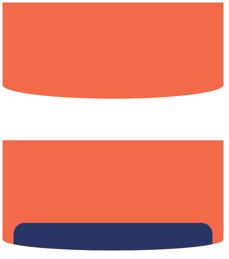

<!--
Created: Thu Jun 11 2020 14:21:40 GMT+0800 (中国标准时间)
Modified: Thu Jun 11 2020 14:21:40 GMT+0800 (中国标准时间)
-->
<!-- css -->

# 用 CSS 画弧形边框

利用伪类 `::after` 和 `border-radius` 来实现如图两种样式


## border-radius

[border-radius MDN](https://developer.mozilla.org/zh-CN/docs/Web/CSS/border-radius)

用 border-radius 画圆和圆角边框是最常用的,但使用的太频繁反而忘记了 `border-radius` 实现圆是怎么实现的.

它其实是根据你给定的**半径**,半径可以设置为 1 个值或 2 个, 一个即为圆,两个为椭圆(用 / 隔开),在与横竖两边相切的地方来画一个圆或椭圆, 两个相切点之间的弧线, 就是画出来的边框圆角.


border-radius: 水平半径 / 垂直半径.

我们知道border-radius是个简写属性，它得展开式：

border-top-left-radius

border-top-right-radius

border-bottom-right-radius

border-botom-left-radius

这四个字如上的顺序，从左上角开始顺时针应用到元素其他三个角上。

但是真正简介的写法还是使用border-radius这个简写属性，只需对应上面的规则，用空格分开多个值，也能达到展开式的效果。

如果只提供了三个值：1 2 3, 则第 4 个值和第 2 个值相同。
如果只提供了二个值：1 2, 则 1 3 相同，2 4 值相同。即对角相同

## 实现弧线的第一种方法
```HTML
<div class="box"></div>
```
```css
.box {
    position: relative;
    width: 400px;
    height: 150px;
    background-color: #f26a4a;
}
.box::after {
    z-index: -1;
    content: "";
    position: absolute;
    left: 0;
    bottom: -25px;
    width: 100%;
    height: 50px;
    border-radius: 50%;
    background-color: #f26a4a;
  }
```
利用伪类生成一个椭圆,将其一半定位在 box 下面, 形成整体呈圆弧样式

## 第二种方式 
```HTML
<div class="test">
   <div class="card"></div>
</div>
```
```css
.test {
  position: relative;
  height: 200px;
  width: 400px;
  background: #f26a4a;
  border-radius: 0% 0% 100% 100% / 0% 0% 20% 20%;
  overflow: hidden;
}
 .card {
    position: absolute;
    left: 0;
    right: 0;
    bottom: 0;
    height: 50px;
    width: 90%;
    margin: auto;
    background: #293565;
    border-radius: 20px 20px 0 0;
  }
```

第二种方式实现更好, 仅用到 border-radius 的长短半径, 生成弧形边框